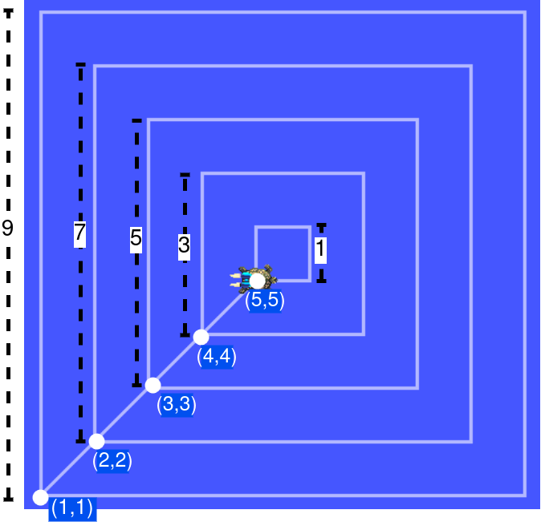

# jason-ros-course-wesaac2024
:toc: right
:author: Maiquel de Brito
:date: July 2023
:source-highlighter: coderay
:coderay-linenums-mode: inline
:icons: font
:prewrap!:


This guide contains practical material for the tutorial _Development of autonomous robots with BDI agents and ROS_ at https://wesaac2024.unb.br/[18th Workshop-School on Agents, Environments and Applications (WESAAC 2024)], 2024, Brasília - Brazil.

The slides presented in the tutorial are available link:https://www.dropbox.com/scl/fi/ueq9zwtv7ogtkdyngwn11/slides.pdf?rlkey=ci3028y1dt6zeta6bhob5r5jv&e=1&dl=0[here].

== Preliminaries

=== Getting the course resources
Clone the repository at https://github.com/embedded-mas/jason-ros-course-wesaac2024 using the following command:
----
git clone https://github.com/embedded-mas/jason-ros-course-wesaac2024.git
----

=== Running ROS
This course requires to install ROS (either version 1 or 2) and the link:http://wiki.ros.org/turtlesim[turtlesim simulator]. 

As alternative, use the script link:https://github.com/embedded-mas/jason-ros-course-wesaac2024/blob/main/resources/ros-launch.sh[`resources/ros-launch.sh`] to launch a Docker container with all the requirements. From the root of the cloned repository, use the following command:
----
./resources/ros-launch.sh
----

When the container is launched, go to link:http://localhost:8080/vnc.html[`http://localhost:8080/vnc.html`] to inspect the simulation.

== Part 1: Introduction to ROS 

Note: if you are running ROS with Docker, open the container terminal with the following command: 
----
sudo docker exec -it turtles_example bash
----

=== Task 1.1: Understanding ROS Topics
* Exercise 1.1.1. The command shown below lists the avaliable topics and the data type that they record. Type it and observe the output.
----
ros2 topic list -t
----

* Exercise 1.1.2. ROS data type (also known as message types) may record complex data structures. Use the command below to check the data structure of the different data types. Replace `[data type]` by the data type to be checked.
----
ros2 interface show [data type]
----

* Exercise 1.1.3. The topic `/turtle1/cmd_vel` records the intended linear and angular velocity of the robot. The robot's controllers read the topic and adjust its velocity accordingly. On the other hand, the robot publishes its current position in the topic `/turtle1/pose`. This exercise explores these topics.

** Type the following command in a shell and observe the output: `ros2 topic echo /turtle1/pose`

** Publish values in the topic `/turtle1/cmd_vel`, changing the values of the parameters `linear.x`, `linear.y`, and `angular.z`, as illustrated below. Observe the reaction of the robot to each command. Observe also the values of the topic `/turtle1/pose`.

  ros2 topic pub -1 /turtle1/cmd_vel geometry_msgs/msg/Twist  "{linear: {x: 1.0, y: 0.0, z: 0.0}, angular: {x: 0.0, y: 0.0, z: 0.0}} "
  ros2 topic pub -1 /turtle1/cmd_vel geometry_msgs/msg/Twist  "{linear: {x: 0.0, y: 1.0, z: 0.0}, angular: {x: 0.0, y: 0.0, z: 0.0}} "
  ros2 topic pub -1 /turtle1/cmd_vel geometry_msgs/msg/Twist  "{linear: {x: 0.0, y: 0.0, z: 0.0}, angular: {x: 0.0, y: 0.0, z: 1.0}} "
  
=== Task 1.2: ROS Services
* Exercise 1.2.1. The command shown below lists the avaliable service and the data type that they request/return. Type it and observe the output.
 
 ros2 service list -t
 
* Exercise 1.2.2. ROS service type define the structure of request and response data. Use the command below to check the data structure of the different service types. Replace `[service type]` by the data type to be ckecked. As a suggestion, check the type of the services `/rosapi/list_parameters` and `/turtle1/set_pen`. What are the inputs and outputs?

 ros2 interface show [service type]

* Exercise 1.2.3. Type the command below in a shell and observe the behaviour of the turtle. Try different values for the fields `x`, `y`, and `z`.

 ros2 service call /turtle1/teleport_absolute turtlesim/srv/TeleportAbsolute "{x: 5.0, y: 5.0, theta: 1}"

* Exercise 1.2.4. Type the command below in a shell and observe the behaviour of the turtle. Try different values for the fields `linear`, and `angular`.

 ros2 service call /turtle1/teleport_relative turtlesim/srv/TeleportRelative "{linear: 1.0, angular: 1.0}"

* Exercise 1.2.5. Use the service `/turtle1/teleport_relative` to move the robot by 2 units of distance of 2 to the right and then upwards.


== Part 2. Introduction to Jason

=== Task 2.1: Run the first JaCaMo application

Exercise 2.1.1. Open the folder link:hands-on/part2/ex1[`hands-on/part2/ex1`] with the Visual Studio Code (or access it in the terminal).  Then, run the project by typing the command below in the terminal:

----
jacamo agents_intro.jcm 
----
or
----
./gradlew run
----


=== Task 2.2: Reading and understanding agent programs

* Exercise 2.2.1: open the JaCaMo application file (link:hands-on/part2/ex1/agents_intro.jcm[`agents_intro.jcm`]) and the personal assistant agent code (file link:hands-on/part2/ex1/src/agt/personal_assistant.asl[`hands-on/part2/ex1/src/agt/personal_assistant.asl`]). Read the files and identify the beliefs, goals, and plans. Try to map the program to the observed behavior. 

* Exercise 2.2.2: open the link:http://localhost:3272/[_mind inspector_] for the agents `bob` and `marie`. Compare the beliefs there with those identified in the program. Are they the same? Are they represented the same way? 

* Exercise 2.2.3: observe the plan in lines 11--12 of the personal assistant agent code (file link:hands-on/part2/ex1/src/agt/personal_assistant.asl[`src/agt/personal_assistant.asl`]). What is the difference between this plan and the other ones?

* Exercise 2.2.4: type the command below, replacing `<agent_id>` by the identifier of an agent (either `bob` or `marie`). Observe the behaviour of the agent. Open the link:http://localhost:3272/[_mind inspector_]  and check whether the belief base of the agent has changed after running this command.

----
curl --request POST 'http://127.0.1.1:8080/agents/<agent_id>/command' --header 'Content-Type: application/x-www-form-urlencoded' --data-urlencode 'c=-+day_of_week(sunday)'
----

=== Task 2.3: Extending the agent program
* Exercise 2.3.1: make the agent `bob` to inform the current date using the plan `inform_date`. The other agents must not give this information.

* Exercise 2.3.2: add a new personal assistant agent to the system. This agent should greet in portuguese ("Bom dia.").

* Exercise 2.3.3: set the language of bob to japanese without adding any plan. Run the system and observe the output. Handle exceptions if needed.

* Exercise 2.3.4 (communicating beliefs): change the code of bob so that, after print the greeting message, it sends a message to alice informing the current day of week. This information must have the form `day_of_week(Day)` (e.g. `day_of_week(sunday)'). Run the application and observe the output.


For the exercises 2.3.5 to 2.3.9, consider that the environment is equipped with a link:https://github.com/CArtAgO-lang/cartago/blob/master/src/main/java/cartago/tools/Clock.java[`clock artifact`]. The agents observe the clock property `nticks`, which records the current time (measured in _ticks_). They can also act upon the clock through the operations `start`(to start the clock), `stop` (to stop the clock), and `setFrequency`, to set the frequency that the frequency the clock is updated.

* Exercise 2.3.5 (getting beliefs from perception - part 1). Open the folder link:hands-on/part2/ex2[`hands-on/part2/ex2`] with the Visual Studio Code. Run the application. Go to the link:http://localhost:3272/[_mind inspector_] and observe the beliefs of agents `bob` and `marie`. Open the JaCaMo application file (link:hands-on/part2/ex2/agents_intro.jcm[`agents_intro.jcm`]) and the personal assistant agent code (file link:hands-on/part2/ex2/src/agt/personal_assistant.asl[`src/agt/personal_assistant.asl`]). Observe the new elements added to these files (compared to the previous exercise).

* Exercise 2.3.6 (getting beliefs from perception - part 2): make both the agents to print the clock value every 10.000 _ticks_.

* Exercise 2.3.7 (understandng goals):  in the agent code available at file link:hands-on/part2/ex2/src/agt/personal_assistant.asl[`hands-on/part2/ex2/src/agt/personal_assistant.asl`], what is the type of the goal `!start_clock`(declarative or procedural)?

* Exercise 2.3.8 (specifying maintenance goals): make alice to print the clock value every 10 _ticks_.

* Exercise 2.3.9 (specifying declarative goals): Open the folder link:hands-on/part2/ex3[`hands-on/part2/ex3`] with the Visual Studio Code. Consider that the agents may have the goal `get_time_elapsed(T)`, which is to be achieved when the clock runs by a time `T` being then stopped. Implement one or more plans to satisfy this goal and add to the agent `bob`  the goal to have the clock finished at 50000 _ticks_. Keep in mind that other agents can handle start/stop the clock. In particular, the agent `tom` may randomly start and stop it.


== Part 3: Introduction to Jason-ROS

In this tutorial, we will develop a BDI agent that moves in a square environment. This agent considers the following beliefs:

* `battery_level(L)`: the avaliable energy level in the robot's battery is `L`. When `L=0`, there is no available energy.
* `security_level(L)`: the current status environmental safety, This belief is supposed to be observed from some environmental device (e.g. an alarm).
* `position(X,Y)`: the current position of the robot in a cartesian coordinate system.

In addition, this agent has the following repertory of actions:

* `move_to(X,Y)`: the robot goes to the coordinate (X,Y).
* `move(D)`: the robot moves forward by a distance `D`.
* `rotate\(R)`: the robot rotates by an angle R (in radians) around its own axis


The cognitive portion of the agent is programmed with Jason. The body of the agent is a turtlebot running in an extended version of the link:http://wiki.ros.org/turtlesim[turtlesim simulator]. This extended simulator provides the following topics:

[cols="2,2,1", options="header"]
|===
| Topic name | Topic type | Description

| /turtleX/energy
| sts_msgs/Int32
| Records an integer value representing the battery level of the robot.

| /turtleX/alarm
| std_msgs/String
| Records a String value representing the status of an alarm that monitors the environmental safety. Possible values of this topic are `safe` and `critical`

| /turtleX/pose
| turtlesim/Pose
| Records a tuple (x, y, theta , linear_velocity, angular_velocity) where (i) `x` and `y` are the coordinates of the robot position in the cartesian coordinate system; (ii) `theta` is the angle between the robot's forward direction and the positive x-axis; (iii) `linear_velocity` is the speed at which the robot is moving in a straight line; and (iv) `angular_velocity`, is the rate of change of the robot's orientation.

| /turtleX/cmd_vel
| geometry_msgs/Twist
| Records the intended linear and angular velocity of the robot. The robot controller reads the topic and adjusts its velocity accordingly, keeping the velocity for 1 second
|===


Besides, the simulator provides the following services:
[cols="1,1,1,3"]
|===
| Service name | Service type | Parameters | Description

| /turtleX/teleport_absolute
| turtlesim/srv/TeleportAbsolute
| float32 x +
  float32 y +
  float32 theta
| Moves the robot’s to a given point (x, y ) +
  in the environment and rotates the robot if needed

| /turtleX/teleport_relative
| turtlesim/srv/TeleportRelative
| float32 linear +
  float32 angular
| Moves the robot’s along a given distance + 
  forward/backward and rotates the robot if needed.
|===


=== Task 3.1: Configuring perceptions

* Exercise 3.1.1. Open the folder link:https://github.com/embedded-mas/jason-ros-course-wesaac2024/tree/main/hands-on/part3/ex1[`hands-on/part3/ex1`] with the Visual Studio Code (or access it in the terminal). Run the JaCaMo application using `./jacamo-ros`. In parallel, check the value of the topic `/turtle1/energy` using the command `ros2 topic echo /turtle1/energy`. 
** Check the beliefs of the agent `robot1` in the mind inspector available at link:http://127.0.1.1:3272/[http://127.0.1.1:3272]. 
** Compare the beliefs of the agent with the value of the topic `/turtle1/energy`. 
** Analyze the relations between the agent's beliefs and the file configurations in the file  link:https://github.com/embedded-mas/jason-ros-course-wesaac2024/blob/main/hands-on/part3/ex1/src/agt/robot1.yaml[`src/agt/robot1.yaml`]. 
** Change the value of the topic using the command `ros2 topic pub /turtle1/energy std_msgs/msg/Int32 '{data: <VALUE>}'` (replacing `VALUE` by some positive integer value) and observe the behaviour of the agent.

* Exercise 3.1.2. In the same application from the previous exerise, the file link:https://github.com/embedded-mas/jason-ros-course-wesaac2024/blob/main/hands-on/part3/ex1/src/agt/ros_agent.asl[`src/agt/ros_agent.asl`] is the source code of an agent that simply prints its battery level. Extend this implementation to print the current environmental safety status when it changes. This status is recorded in the ROS topic `/turtle1/alarm`.

* Exercise 3.1.3. Extend the code of the agent of to print its current position (X,Y) when it changes. The agent records this information in the belief `position(X,Y)`. To test the position changing, move the robot with the following command:
```
ros2 topic pub -1 /turtle1/cmd_vel geometry_msgs/msg/Twist  "{linear: {x: 1.0, y: 1.0}} "
```

=== Task 3.2: Configuring actions

In the exercises 3.2.1 to 3.2.3, consider that the actions of the agent can be concretely carried out through topic writing and service requests. The effectors of the robot are controlled by the topic `/turtleX/cmd_vel` and by the services `turtleX/teleport_absolute` and `/turtleX/teleport_relative`.


* Exercise 3.2.1: Open the JaCaMo application at link:https://github.com/embedded-mas/jason-ros-course-wesaac2024/tree/main/hands-on/part3/ex2.1[`hands-on/part3/ex2.1`]. Make the agent to use the action `move_to` to go to the coordinates (2,2). This action must be realized through the ROS service `/turtle1/teleport_absolute`. This requires changes in the code of the agent (link:https://github.com/embedded-mas/jason-ros-course-wesaac2024/blob/main/hands-on/part3/ex2.1/src/agt/ros_agent.asl[.asl file]) and in the connection between the action `move_to` and the ROS service that actually realizes it, specified in the link:https://github.com/embedded-mas/jason-ros-course-wesaac2024/blob/main/hands-on/part3/ex2.1/src/agt/robot1.yaml[.yaml file]. The comment "TODO: Exercice 3.2.1:..." indicates the place where the changes must be implemented in both the files.

* Exercise 3.2.2: Open the JaCaMo application at link:https://github.com/embedded-mas/jason-ros-course-wesaac2024/tree/main/hands-on/part3/ex2.2[`hands-on/part3/ex2.2`]. Make the agent to use the action `move` to move along 2 distance units to the right and then 2 distance units upwards. This requires changes in the code of the agent (link:https://github.com/embedded-mas/jason-ros-course-wesaac2024/blob/main/hands-on/part3/ex2.2/src/agt/ros_agent.asl[.asl file]) and in the connection between the action `move_to` and the ROS service that actually realizes it, specified in the link:https://github.com/embedded-mas/jason-ros-course-wesaac2024/blob/main/hands-on/part3/ex2.2/src/agt/robot1.yaml[.yaml file]. The comment "TODO: Exercice 3.2.2:..." indicates the place where the changes must be implemented in both the files.

* Exercise 3.2.3: Improve the implementation of Exercise 3.2.2. Make the robot to draw  a square with side length 2.

== Part 4: Advancing on Jason-ROS


* Exercise 4.1. Open the JaCaMo application at link:https://github.com/embedded-mas/jason-ros-course-wesaac2024/tree/main/hands-on/part4/ex1[`hands-on/part4/ex1`]. This is a system where a robot has the mission to navigate the entire environment in square-shaped routes. It begins at the coordinate (1,1) and runs along a square route of side length 9. Then, it moves (i) to the coordinate (2,2) and runs along a square route of side length 7, (ii) to (3,3) and runs along a square route of side length 5, (iii) to (4,4) and runs along a square route of side length 3, and (iv) to (5,5) and runs along a square route of side length 1. 


[[imgenvsmartroom]]
.turtle scenario
====

====


The energy of the robot decreases as it moves. The faster it moves, the more energy it consumes. If the energy reaches zero, the robot is destroyed. Implement the agent so that it accomplishes its mission.

** The belief `velocity(V)` records the velocity `V` the robot decides to move (in any direction).
** It may be necessary to slow down to avoid exceeding the limit point before changing the direction. Consider to use the rule `control_factor(D,P,F)` to calculate a control factor `F` (s.t. `F<0`) to multiply by the default velocity. This factor is calculated as a function of the traveled distance `P` and the distance to travel `D`.
** The comment "TODO: ..." suggest the place where the changes can be implemented in the link:https://github.com/embedded-mas/jason-ros-course-wesaac2024/blob/main/hands-on/part4/ex1/src/agt/ros_agent.asl[agent source code].


